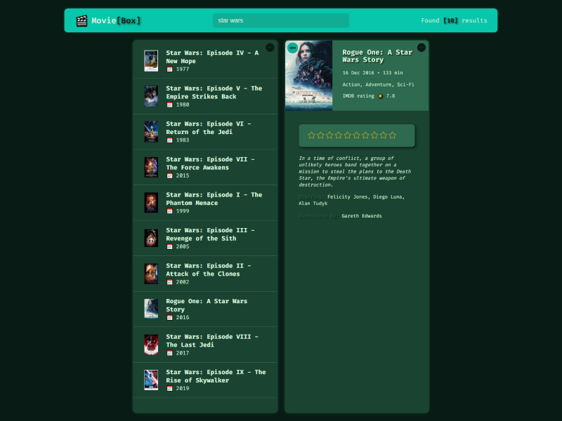

# MovieBox App

## A simple react app that uses the core principles of the react library and interacts with [_omdbapi_](https://omdbapi.com) database.

### Getting Started

To get started with moviebox, you will need to have Node.js and Vite installed on your machine.

To install Node.js, visit the Node.js website: [node](https://nodejs.org)

To install Vite, run the following command in your terminal:

```
npm install -g vite
```

Once you have Node.js and Vite installed, you can clone the moviebox repository to your local machine:

```
git clone https://github.com/bakna2t/moviebox.git
```

Navigate to the moviebox directory and install the dependencies:

```
cd moviebox
npm install
```

To start the development server, run the following command:

```
npm run dev
```

The development server will be running on http://localhost:5173. You can open this URL in your web browser to view the moviebox app.

click here to visit => [_**MovieBox ReactApp**_](https://moviebox-ok.vercel.app/)

---

<div align="center">
    <p style="width: 500px;">
        <a href="https://moviebox-ok.vercel.app/" target="_blank" >
            
        </a>
    </p>
</div>
